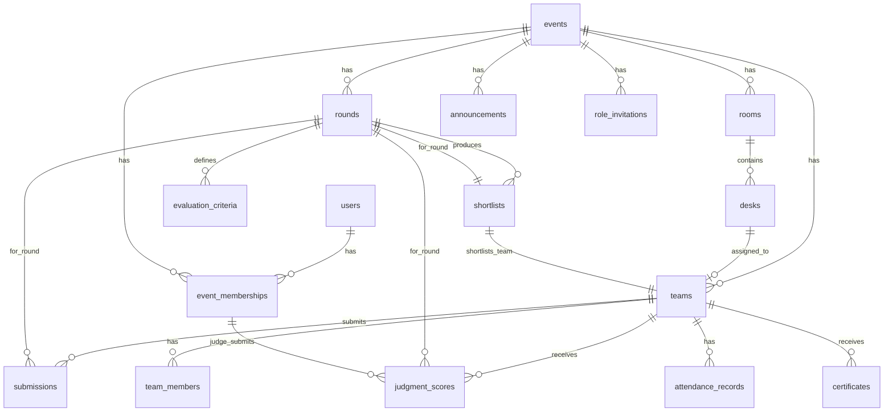

# Database Architecture — HackFlow

## Engine: TiDB (MySQL 8.0–compatible)
## ORM: Drizzle ORM (mysql-core + @tidbcloud/serverless driver)

---

## TiDB Compatibility Notes

| Feature | Status | Notes |
|---|---|---|
| `SELECT ... FOR UPDATE` | ✅ Supported | Pessimistic mode (default in modern TiDB) |
| `SKIP LOCKED` | ❌ Not supported | Use `FOR UPDATE` with transaction retry |
| `NOWAIT` | ✅ Supported | Fail immediately if lock unavailable |
| JSON columns | ✅ Supported | Full `JSON_EXTRACT`, `->`, `->>` support |
| UUID functions | ✅ Supported | `UUID()`, `UUID_TO_BIN()`, `BIN_TO_UUID()` |
| Foreign keys | ✅ Supported | Standard MySQL FK syntax |
| Unique constraints | ✅ Supported | Composite unique supported |
| Transactions | ✅ Supported | Pessimistic default; optimistic available |
| Auto-increment | ✅ Supported | Use `AUTO_RANDOM` for distributed hot-key avoidance |
| SERIAL | ⚠️ Alias | Maps to `BIGINT UNSIGNED AUTO_INCREMENT` |
| Stored procedures | ❌ Not supported | Keep logic in application layer |
| Triggers | ❌ Not supported | Keep logic in application layer |
| Full-text indexes | ⚠️ Limited | Use application-level search |

---

## Schema Design

### Design Principles
1. **Event isolation**: All data-bearing tables have `event_id` FK or transitively relate to an event
2. **Role isolation**: Users table is role-agnostic; roles are event-scoped via `event_memberships`
3. **Audit-ready**: `created_at`, `updated_at` on all tables; dedicated `audit_logs` table for admin actions
4. **No PostgreSQL-isms**: No SERIAL (use INT AUTO_INCREMENT or BIGINT AUTO_RANDOM), no JSONB (use JSON), no array types
5. **Soft constraints**: Business rules enforced in service layer + DB constraints where possible

---

## Entity Relationship Diagram



---

## Table Definitions

### 1. `users`

Unified user table. Role assignment is event-scoped, not user-global.

```sql
CREATE TABLE users (
    id          VARCHAR(36) PRIMARY KEY DEFAULT (UUID()),
    email       VARCHAR(255) UNIQUE NOT NULL,
    name        VARCHAR(255),
    avatar_url  VARCHAR(512),
    provider    VARCHAR(50) NOT NULL DEFAULT 'google',
    provider_id VARCHAR(255),
    created_at  TIMESTAMP DEFAULT CURRENT_TIMESTAMP,
    updated_at  TIMESTAMP DEFAULT CURRENT_TIMESTAMP ON UPDATE CURRENT_TIMESTAMP,
    
    INDEX idx_users_email (email),
    INDEX idx_users_provider (provider, provider_id)
);
```

**Design rationale**: Single `users` table instead of separate `organizers`/`participants` tables. The research's split model creates unnecessary complexity — a user might be organizer for one event and participant for another. Event-scoped roles via `event_memberships` solve this cleanly.

---

### 2. `events`

```sql
CREATE TABLE events (
    id                  VARCHAR(36) PRIMARY KEY DEFAULT (UUID()),
    organizer_id        VARCHAR(36) NOT NULL,
    title               VARCHAR(255) NOT NULL,
    slug                VARCHAR(255) UNIQUE NOT NULL,
    description         TEXT,
    
    -- Team constraints
    min_team_size       INT NOT NULL DEFAULT 1,
    max_team_size       INT NOT NULL DEFAULT 5,
    max_teams           INT,                          -- NULL = unlimited
    winners_count       INT NOT NULL DEFAULT 3,
    
    -- Registration
    registration_method ENUM('NATIVE', 'EXTERNAL') NOT NULL DEFAULT 'NATIVE',
    external_form_url   VARCHAR(512),
    form_schema         JSON,                         -- Dynamic form definition
    registration_opens  TIMESTAMP,
    registration_closes TIMESTAMP,
    
    -- Event timing
    event_starts        TIMESTAMP,
    event_ends          TIMESTAMP,
    
    -- State
    status              ENUM(
                            'DRAFT',
                            'REGISTRATION_OPEN',
                            'REGISTRATION_CLOSED',
                            'EVENT_READY',
                            'ROUND_ACTIVE',
                            'EVENT_COMPLETED'
                        ) NOT NULL DEFAULT 'DRAFT',
    active_round_id     VARCHAR(36),                  -- FK to current round
    
    -- QR security
    qr_secret           VARCHAR(255) NOT NULL,        -- HMAC key for this event's QR tokens
    
    created_at          TIMESTAMP DEFAULT CURRENT_TIMESTAMP,
    updated_at          TIMESTAMP DEFAULT CURRENT_TIMESTAMP ON UPDATE CURRENT_TIMESTAMP,
    
    FOREIGN KEY (organizer_id) REFERENCES users(id),
    INDEX idx_events_slug (slug),
    INDEX idx_events_organizer (organizer_id),
    INDEX idx_events_status (status)
);
```

**Key decisions**:
- `form_schema` as JSON stores dynamic registration form configuration
- `qr_secret` per-event allows event-isolated QR security
- `active_round_id` denormalized for fast "current round" lookups
- `status` ENUM enforces valid state machine states at DB level

---

### 3. `event_memberships`

Maps users to events with specific roles.

```sql
CREATE TABLE event_memberships (
    id          VARCHAR(36) PRIMARY KEY DEFAULT (UUID()),
    user_id     VARCHAR(36) NOT NULL,
    event_id    VARCHAR(36) NOT NULL,
    role        ENUM('ORGANIZER', 'COORDINATOR', 'JUDGE', 'PARTICIPANT') NOT NULL,
    
    -- For coordinator/judge: track invitation
    invitation_id VARCHAR(36),
    
    created_at  TIMESTAMP DEFAULT CURRENT_TIMESTAMP,
    updated_at  TIMESTAMP DEFAULT CURRENT_TIMESTAMP ON UPDATE CURRENT_TIMESTAMP,
    
    FOREIGN KEY (user_id) REFERENCES users(id),
    FOREIGN KEY (event_id) REFERENCES events(id) ON DELETE CASCADE,
    UNIQUE KEY uq_membership (user_id, event_id, role),
    INDEX idx_membership_event_role (event_id, role),
    INDEX idx_membership_user (user_id)
);
```

**Why unique on `(user_id, event_id, role)`**: A user can have only one membership of each role per event. They CAN have multiple roles (e.g., organizer AND judge) — edge case but allowed.

---

### 4. `role_invitations`

Secure invitation tokens for coordinator/judge onboarding.

```sql
CREATE TABLE role_invitations (
    id          VARCHAR(36) PRIMARY KEY DEFAULT (UUID()),
    event_id    VARCHAR(36) NOT NULL,
    role        ENUM('COORDINATOR', 'JUDGE') NOT NULL,
    token       VARCHAR(255) UNIQUE NOT NULL,           -- Cryptographically random
    
    -- Security
    created_by  VARCHAR(36) NOT NULL,                   -- Organizer who created
    expires_at  TIMESTAMP NOT NULL,
    max_uses    INT DEFAULT 1,                          -- NULL = unlimited
    use_count   INT DEFAULT 0,
    is_revoked  BOOLEAN DEFAULT FALSE,
    
    created_at  TIMESTAMP DEFAULT CURRENT_TIMESTAMP,
    
    FOREIGN KEY (event_id) REFERENCES events(id) ON DELETE CASCADE,
    FOREIGN KEY (created_by) REFERENCES users(id),
    INDEX idx_invitation_token (token),
    INDEX idx_invitation_event (event_id)
);
```

**Security**: Invitations have expiry, max-use count, and revocation. A URL alone does NOT grant access — the user must also authenticate with Google and the invitation must be valid.

---

### 5. `rounds`

```sql
CREATE TABLE rounds (
    id                  VARCHAR(36) PRIMARY KEY DEFAULT (UUID()),
    event_id            VARCHAR(36) NOT NULL,
    round_number        INT NOT NULL,
    title               VARCHAR(255),
    
    -- Timing
    starts_at           TIMESTAMP,
    ends_at             TIMESTAMP,
    problem_reveal_at   TIMESTAMP,                    -- When problem statements become visible
    submission_deadline  TIMESTAMP,
    
    -- Problem statements
    problem_statements  JSON,                         -- Array of {id, title, description}
    
    -- Configuration
    shortlist_count     INT,                          -- How many teams advance
    retain_desks        BOOLEAN DEFAULT TRUE,         -- Retain previous desk assignments
    
    -- State
    status              ENUM(
                            'DRAFT',
                            'SUBMISSION_OPEN',
                            'SUBMISSION_LOCKED',
                            'JUDGING',
                            'RESULTS_PENDING',
                            'RESULTS_PUBLISHED'
                        ) NOT NULL DEFAULT 'DRAFT',
    
    created_at          TIMESTAMP DEFAULT CURRENT_TIMESTAMP,
    updated_at          TIMESTAMP DEFAULT CURRENT_TIMESTAMP ON UPDATE CURRENT_TIMESTAMP,
    
    FOREIGN KEY (event_id) REFERENCES events(id) ON DELETE CASCADE,
    UNIQUE KEY uq_round_number (event_id, round_number),
    INDEX idx_rounds_event (event_id)
);
```

---

### 6. `rooms`

```sql
CREATE TABLE rooms (
    id          VARCHAR(36) PRIMARY KEY DEFAULT (UUID()),
    event_id    VARCHAR(36) NOT NULL,
    name        VARCHAR(100) NOT NULL,
    room_number INT NOT NULL,
    is_active   BOOLEAN DEFAULT TRUE,                 -- Can be deactivated between rounds
    
    created_at  TIMESTAMP DEFAULT CURRENT_TIMESTAMP,
    updated_at  TIMESTAMP DEFAULT CURRENT_TIMESTAMP ON UPDATE CURRENT_TIMESTAMP,
    
    FOREIGN KEY (event_id) REFERENCES events(id) ON DELETE CASCADE,
    UNIQUE KEY uq_room (event_id, room_number),
    INDEX idx_rooms_event (event_id)
);
```

---

### 7. `desks`

```sql
CREATE TABLE desks (
    id              VARCHAR(36) PRIMARY KEY DEFAULT (UUID()),
    room_id         VARCHAR(36) NOT NULL,
    desk_number     INT NOT NULL,
    capacity        INT NOT NULL DEFAULT 4,
    is_allocated    BOOLEAN DEFAULT FALSE,
    
    created_at      TIMESTAMP DEFAULT CURRENT_TIMESTAMP,
    updated_at      TIMESTAMP DEFAULT CURRENT_TIMESTAMP ON UPDATE CURRENT_TIMESTAMP,
    
    FOREIGN KEY (room_id) REFERENCES rooms(id) ON DELETE CASCADE,
    UNIQUE KEY uq_desk (room_id, desk_number),
    INDEX idx_desks_room (room_id),
    INDEX idx_desks_available (room_id, is_allocated, capacity)
);
```

**Index `idx_desks_available`**: Composite index specifically for the desk allocation query: `WHERE room_id IN (...) AND is_allocated = FALSE AND capacity >= ?`

---

### 8. `teams`

```sql
CREATE TABLE teams (
    id              VARCHAR(36) PRIMARY KEY DEFAULT (UUID()),
    event_id        VARCHAR(36) NOT NULL,
    leader_id       VARCHAR(36) NOT NULL,              -- FK to users
    name            VARCHAR(255) NOT NULL,
    member_count    INT NOT NULL,
    
    -- Physical allocation
    desk_id         VARCHAR(36),                       -- NULL = waitlisted
    status          ENUM('REGISTERED', 'WAITLISTED', 'CHECKED_IN', 
                         'ACTIVE', 'SHORTLISTED', 'ELIMINATED', 
                         'FINALIST', 'WINNER') NOT NULL DEFAULT 'REGISTERED',
    
    -- QR
    qr_token        VARCHAR(255) UNIQUE NOT NULL,      -- HMAC-signed token
    
    -- Registration data
    form_responses  JSON,                              -- Custom form field values
    project_name    VARCHAR(255),
    project_description TEXT,
    
    -- Round tracking
    current_round_id VARCHAR(36),                      -- Last round this team participated in
    
    created_at      TIMESTAMP DEFAULT CURRENT_TIMESTAMP,
    updated_at      TIMESTAMP DEFAULT CURRENT_TIMESTAMP ON UPDATE CURRENT_TIMESTAMP,
    
    FOREIGN KEY (event_id) REFERENCES events(id) ON DELETE CASCADE,
    FOREIGN KEY (leader_id) REFERENCES users(id),
    FOREIGN KEY (desk_id) REFERENCES desks(id) ON DELETE SET NULL,
    UNIQUE KEY uq_team_name (event_id, name),
    UNIQUE KEY uq_team_leader (event_id, leader_id),
    INDEX idx_teams_event (event_id),
    INDEX idx_teams_desk (desk_id),
    INDEX idx_teams_status (event_id, status),
    INDEX idx_teams_qr (qr_token)
);
```

**Design decisions**:
- `status` tracks team lifecycle across the entire event
- `form_responses` as JSON stores dynamic registration form answers
- `desk_id = NULL` explicitly means waitlisted (no separate waitlist table needed)
- Unique constraint on `(event_id, leader_id)` prevents duplicate registration
- `current_round_id` tracks the furthest round reached

---

### 9. `team_members`

```sql
CREATE TABLE team_members (
    id          VARCHAR(36) PRIMARY KEY DEFAULT (UUID()),
    team_id     VARCHAR(36) NOT NULL,
    name        VARCHAR(255) NOT NULL,
    email       VARCHAR(255) NOT NULL,
    phone       VARCHAR(20),
    is_leader   BOOLEAN DEFAULT FALSE,
    
    created_at  TIMESTAMP DEFAULT CURRENT_TIMESTAMP,
    
    FOREIGN KEY (team_id) REFERENCES teams(id) ON DELETE CASCADE,
    UNIQUE KEY uq_member_email_team (team_id, email),
    INDEX idx_members_team (team_id)
);
```

---

### 10. `attendance_records`

Separate from teams to maintain audit history. Multiple records possible (undo + redo).

```sql
CREATE TABLE attendance_records (
    id              VARCHAR(36) PRIMARY KEY DEFAULT (UUID()),
    team_id         VARCHAR(36) NOT NULL,
    event_id        VARCHAR(36) NOT NULL,
    
    -- Who processed the check-in
    checked_in_by   VARCHAR(36) NOT NULL,              -- coordinator/organizer user_id
    check_in_method ENUM('QR_SCAN', 'MANUAL') NOT NULL,
    
    -- State
    is_active       BOOLEAN DEFAULT TRUE,              -- FALSE if undone
    
    checked_in_at   TIMESTAMP DEFAULT CURRENT_TIMESTAMP,
    undone_at       TIMESTAMP,
    undone_by       VARCHAR(36),
    
    FOREIGN KEY (team_id) REFERENCES teams(id) ON DELETE CASCADE,
    FOREIGN KEY (event_id) REFERENCES events(id) ON DELETE CASCADE,
    FOREIGN KEY (checked_in_by) REFERENCES users(id),
    INDEX idx_attendance_team (team_id),
    INDEX idx_attendance_event (event_id, is_active)
);
```

**Why separate table**: The research uses `teams.attended` boolean. This loses: who checked in, when, how (QR vs manual), undo capability. An attendance record table preserves all of this.

---

### 11. `evaluation_criteria`

```sql
CREATE TABLE evaluation_criteria (
    id              VARCHAR(36) PRIMARY KEY DEFAULT (UUID()),
    round_id        VARCHAR(36) NOT NULL,
    name            VARCHAR(255) NOT NULL,
    description     TEXT,
    max_points      INT NOT NULL,
    weight          DECIMAL(5,2) DEFAULT 1.00,         -- For weighted scoring
    display_order   INT NOT NULL DEFAULT 0,
    is_required     BOOLEAN DEFAULT TRUE,
    
    created_at      TIMESTAMP DEFAULT CURRENT_TIMESTAMP,
    updated_at      TIMESTAMP DEFAULT CURRENT_TIMESTAMP ON UPDATE CURRENT_TIMESTAMP,
    
    FOREIGN KEY (round_id) REFERENCES rounds(id) ON DELETE CASCADE,
    INDEX idx_criteria_round (round_id)
);
```

---

### 12. `judgment_scores`

```sql
CREATE TABLE judgment_scores (
    id              VARCHAR(36) PRIMARY KEY DEFAULT (UUID()),
    team_id         VARCHAR(36) NOT NULL,
    judge_id        VARCHAR(36) NOT NULL,              -- user_id of judge
    round_id        VARCHAR(36) NOT NULL,
    criteria_id     VARCHAR(36) NOT NULL,
    event_id        VARCHAR(36) NOT NULL,              -- Denormalized for query efficiency
    
    score           INT NOT NULL,
    
    -- Audit
    idempotency_key VARCHAR(255),                      -- Prevents duplicate submissions
    
    created_at      TIMESTAMP DEFAULT CURRENT_TIMESTAMP,
    updated_at      TIMESTAMP DEFAULT CURRENT_TIMESTAMP ON UPDATE CURRENT_TIMESTAMP,
    
    FOREIGN KEY (team_id) REFERENCES teams(id) ON DELETE CASCADE,
    FOREIGN KEY (judge_id) REFERENCES users(id),
    FOREIGN KEY (round_id) REFERENCES rounds(id) ON DELETE CASCADE,
    FOREIGN KEY (criteria_id) REFERENCES evaluation_criteria(id) ON DELETE CASCADE,
    FOREIGN KEY (event_id) REFERENCES events(id) ON DELETE CASCADE,
    
    -- CRITICAL: Prevents same judge from scoring same team+round+criterion twice
    UNIQUE KEY uq_judgment (team_id, judge_id, round_id, criteria_id),
    
    INDEX idx_judgment_team_round (team_id, round_id),
    INDEX idx_judgment_judge (judge_id, round_id),
    INDEX idx_judgment_event_round (event_id, round_id)
);
```

**Concurrency protection**: The `UNIQUE KEY uq_judgment` prevents duplicate scoring at the DB level, not just frontend.

---

### 13. `judgment_corrections`

Audit trail for score corrections. Original scores are NEVER overwritten.

```sql
CREATE TABLE judgment_corrections (
    id              VARCHAR(36) PRIMARY KEY DEFAULT (UUID()),
    judgment_id     VARCHAR(36) NOT NULL,               -- FK to original judgment_scores
    
    original_score  INT NOT NULL,
    corrected_score INT NOT NULL,
    corrected_by    VARCHAR(36) NOT NULL,               -- user_id (judge or organizer)
    reason          TEXT,
    
    created_at      TIMESTAMP DEFAULT CURRENT_TIMESTAMP,
    
    FOREIGN KEY (judgment_id) REFERENCES judgment_scores(id),
    FOREIGN KEY (corrected_by) REFERENCES users(id),
    INDEX idx_corrections_judgment (judgment_id)
);
```

---

### 14. `submissions`

```sql
CREATE TABLE submissions (
    id              VARCHAR(36) PRIMARY KEY DEFAULT (UUID()),
    team_id         VARCHAR(36) NOT NULL,
    round_id        VARCHAR(36) NOT NULL,
    event_id        VARCHAR(36) NOT NULL,
    
    -- Submission data
    github_url      VARCHAR(512),
    ppt_file_key    VARCHAR(512),                      -- Storage key for uploaded file
    ppt_filename    VARCHAR(255),
    ppt_file_size   INT,
    problem_statement_id VARCHAR(36),                  -- Which problem they chose
    
    -- State
    is_locked       BOOLEAN DEFAULT FALSE,             -- Locked after deadline
    submitted_at    TIMESTAMP,
    
    created_at      TIMESTAMP DEFAULT CURRENT_TIMESTAMP,
    updated_at      TIMESTAMP DEFAULT CURRENT_TIMESTAMP ON UPDATE CURRENT_TIMESTAMP,
    
    FOREIGN KEY (team_id) REFERENCES teams(id) ON DELETE CASCADE,
    FOREIGN KEY (round_id) REFERENCES rounds(id) ON DELETE CASCADE,
    FOREIGN KEY (event_id) REFERENCES events(id) ON DELETE CASCADE,
    UNIQUE KEY uq_submission (team_id, round_id),
    INDEX idx_submissions_round (round_id, event_id)
);
```

---

### 15. `shortlists`

Records which teams were shortlisted in each round.

```sql
CREATE TABLE shortlists (
    id              VARCHAR(36) PRIMARY KEY DEFAULT (UUID()),
    team_id         VARCHAR(36) NOT NULL,
    round_id        VARCHAR(36) NOT NULL,
    event_id        VARCHAR(36) NOT NULL,
    
    -- Ranking
    calculated_rank INT NOT NULL,                      -- Raw score-based rank
    final_rank      INT,                               -- Override rank (NULL = use calculated)
    total_score     DECIMAL(10,2) NOT NULL,
    
    -- Status
    is_advancing    BOOLEAN NOT NULL,                  -- TRUE = moves to next round
    
    created_at      TIMESTAMP DEFAULT CURRENT_TIMESTAMP,
    
    FOREIGN KEY (team_id) REFERENCES teams(id) ON DELETE CASCADE,
    FOREIGN KEY (round_id) REFERENCES rounds(id) ON DELETE CASCADE,
    FOREIGN KEY (event_id) REFERENCES events(id) ON DELETE CASCADE,
    UNIQUE KEY uq_shortlist (team_id, round_id),
    INDEX idx_shortlist_round (round_id, event_id),
    INDEX idx_shortlist_rank (event_id, round_id, final_rank)
);
```

**Design**: `calculated_rank` always reflects raw scores. `final_rank` is organizer override (NULL = no override). Query uses `COALESCE(final_rank, calculated_rank)` for display.

---

### 16. `certificates`

```sql
CREATE TABLE certificates (
    id              VARCHAR(36) PRIMARY KEY DEFAULT (UUID()),
    event_id        VARCHAR(36) NOT NULL,
    team_id         VARCHAR(36) NOT NULL,
    recipient_name  VARCHAR(255) NOT NULL,
    
    type            ENUM('PARTICIPANT', 'WINNER', 'RUNNER_UP', 'SPECIAL') NOT NULL,
    file_key        VARCHAR(512),                      -- Storage key for generated PDF
    
    generated_at    TIMESTAMP,
    downloaded_at   TIMESTAMP,
    
    created_at      TIMESTAMP DEFAULT CURRENT_TIMESTAMP,
    
    FOREIGN KEY (event_id) REFERENCES events(id) ON DELETE CASCADE,
    FOREIGN KEY (team_id) REFERENCES teams(id) ON DELETE CASCADE,
    INDEX idx_certificates_team (team_id),
    INDEX idx_certificates_event (event_id)
);
```

---

### 17. `announcements`

```sql
CREATE TABLE announcements (
    id              VARCHAR(36) PRIMARY KEY DEFAULT (UUID()),
    event_id        VARCHAR(36) NOT NULL,
    
    title           VARCHAR(255) NOT NULL,
    content         TEXT NOT NULL,
    priority        ENUM('LOW', 'NORMAL', 'HIGH', 'URGENT') DEFAULT 'NORMAL',
    
    -- Targeting
    target_role     ENUM('ALL', 'PARTICIPANT', 'COORDINATOR', 'JUDGE'),
    
    created_by      VARCHAR(36) NOT NULL,
    created_at      TIMESTAMP DEFAULT CURRENT_TIMESTAMP,
    
    FOREIGN KEY (event_id) REFERENCES events(id) ON DELETE CASCADE,
    FOREIGN KEY (created_by) REFERENCES users(id),
    INDEX idx_announcements_event (event_id, created_at DESC)
);
```

---

### 18. `audit_logs`

```sql
CREATE TABLE audit_logs (
    id              VARCHAR(36) PRIMARY KEY DEFAULT (UUID()),
    event_id        VARCHAR(36),
    user_id         VARCHAR(36) NOT NULL,
    
    action          VARCHAR(100) NOT NULL,             -- e.g., 'desk.reassigned', 'score.corrected'
    entity_type     VARCHAR(50) NOT NULL,              -- e.g., 'team', 'desk', 'judgment'
    entity_id       VARCHAR(36),
    
    details         JSON,                              -- Action-specific context
    ip_address      VARCHAR(45),
    user_agent      VARCHAR(512),
    
    created_at      TIMESTAMP DEFAULT CURRENT_TIMESTAMP,
    
    FOREIGN KEY (event_id) REFERENCES events(id) ON DELETE SET NULL,
    FOREIGN KEY (user_id) REFERENCES users(id),
    INDEX idx_audit_event (event_id, created_at DESC),
    INDEX idx_audit_entity (entity_type, entity_id),
    INDEX idx_audit_action (action)
);
```

**Logged actions include**:
- `desk.assigned`, `desk.reassigned`, `desk.released`
- `team.registered`, `team.waitlisted`, `team.eliminated`, `team.manual_checkin`
- `attendance.checked_in`, `attendance.undone`
- `score.submitted`, `score.corrected`, `score.overridden`
- `rank.overridden`
- `round.started`, `round.results_published`
- `invitation.created`, `invitation.revoked`
- `event.status_changed`

---

## Index Strategy

### Performance-Critical Queries

| Query | Tables | Indexes Used |
|---|---|---|
| Find available desk for allocation | `desks` | `idx_desks_available (room_id, is_allocated, capacity)` |
| Get teams by event + status | `teams` | `idx_teams_status (event_id, status)` |
| Check duplicate judgment | `judgment_scores` | `uq_judgment (team_id, judge_id, round_id, criteria_id)` |
| Get scoring matrix | `judgment_scores` | `idx_judgment_event_round (event_id, round_id)` |
| Lookup team by QR token | `teams` | `idx_teams_qr (qr_token)` |
| Get event by slug | `events` | `idx_events_slug (slug)` |
| Get shortlist with ranks | `shortlists` | `idx_shortlist_rank (event_id, round_id, final_rank)` |
| Audit trail for entity | `audit_logs` | `idx_audit_entity (entity_type, entity_id)` |

---

## Migration Strategy

- All migrations stored in `src/lib/db/migrations/`
- Drizzle Kit generates SQL migration files from schema changes
- Migrations are versioned and sequential (e.g., `0001_initial.sql`, `0002_add_certificates.sql`)
- Every schema change requires a corresponding migration file
- Rollback scripts maintained for destructive changes
- Production migrations run via CI/CD or manual `drizzle-kit push`
