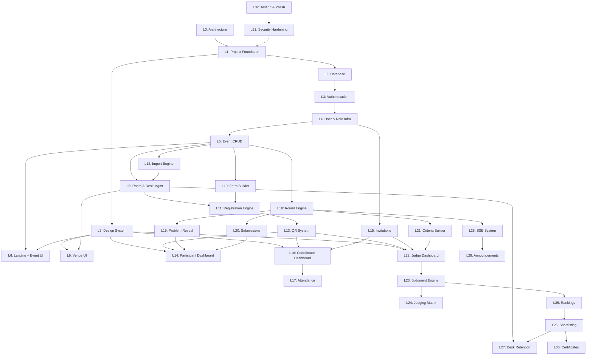

# Implementation Plan — HackFlow

## Offline-First Physical Hackathon Management Platform

---

## PROJECT STATUS

| Field | Value |
|---|---|
| **Project** | HackFlow — Physical Hackathon Management Platform |
| **Tech Stack** | Next.js 16 (App Router) + TypeScript + TiDB/MySQL + Drizzle ORM + Google Auth + SSE |
| **Current Level** | Level 32 / 32 |
| **Current Phase** | ✅ ALL LEVELS COMPLETE |
| **Repository** | `e:\PROJECTS SEP 2026\HACKATHON` |

### Progress

| Status | Levels |
|---|---|
| ✅ **Completed** | Level 0–32 (ALL) |
| 🔄 **In Progress** | — |
| ⏳ **Next** | — |
| 📋 **Future** | UI iteration & deployment |
| 🚫 **Blockers** | None |

---

## LEVEL OVERVIEW

| Level | Name | Status | Dependencies |
|---|---|---|---|
| 0 | Architecture & Planning | ✅ | None |
| 1 | Project Foundation | ✅ | L0 |
| 2 | Database Foundation | ✅ | L1 |
| 3 | Authentication (Google OAuth) | ✅ | L1, L2 |
| 4 | User & Role Infrastructure | ✅ | L3 |
| 5 | Event CRUD | ✅ | L4 |
| 6 | Landing Page & Event List UI | ✅ | L5 |
| 7 | Design System & Theming (Day/Night) | ✅ | L1 |
| 8 | Room & Desk Management | ✅ | L5 |
| 9 | Room & Desk UI (Organizer) | ✅ | L7, L8 |
| 10 | Registration Form Builder | ✅ | L5 |
| 11 | Native Registration Engine | ✅ | L10, L8 |
| 12 | Excel/CSV Import Engine | ✅ | L5, L8 |
| 13 | Universal QR System | ✅ | L11 |
| 14 | Participant Dashboard | ✅ | L7, L11, L13 |
| 15 | Invitation System (Coordinator/Judge) | ✅ | L4 |
| 16 | Coordinator Scanner Dashboard | ✅ | L7, L13, L15 |
| 17 | Attendance System | ✅ | L16 |
| 18 | Round Management Engine | ✅ | L5 |
| 19 | Problem Statement & Reveal | ✅ | L18, L14 |
| 20 | Submission System | ✅ | L18, L14 |
| 21 | Evaluation Criteria Builder | ✅ | L18 |
| 22 | Judge Scanner Dashboard | ✅ | L7, L13, L15, L21 |
| 23 | Judgment Submission Engine | ✅ | L22, L21 |
| 24 | Organizer Judging Matrix | ✅ | L23 |
| 25 | Scoring & Rankings Engine | ✅ | L23 |
| 26 | Shortlisting & Result Publication | ✅ | L25 |
| 27 | Desk Retention & Multi-Round Flow | ✅ | L26, L8 |
| 28 | Real-Time Event System (SSE) | ✅ | L18 |
| 29 | Announcements System | ✅ | L28 |
| 30 | Certificate Generation | ✅ | L26 |
| 31 | Audit Logging & Security Hardening | ✅ | All above |
| 32 | Testing, Polish & Production Readiness | ✅ | All above |

---

## LEVEL DETAILS

---

### LEVEL 0 — Architecture & Planning
**Status**: ✅ COMPLETE

**Purpose**: Analyze requirements, research technology constraints, design complete system architecture, and create persistent documentation.

**Delivered**:
- `docs/PROJECT_ARCHITECTURE.md` — System design, tech stack, project structure
- `docs/DATABASE_ARCHITECTURE.md` — 18 tables, indexes, TiDB compatibility analysis
- `docs/API_ARCHITECTURE.md` — Complete route map, request/response contracts
- `docs/SECURITY_ARCHITECTURE.md` — Auth, authz, QR security, IDOR prevention
- `docs/USER_FLOWS.md` — All four roles with screen mockups
- `docs/DECISIONS.md` — 12 architectural decisions with rationale
- `docs/IMPLEMENTATION_PLAN.md` — This document

**Acceptance**: ✅ All documents created with comprehensive coverage

---

### LEVEL 1 — Project Foundation
**Status**: ⏳ NOT STARTED

**Purpose**: Initialize Next.js project with TypeScript, configure build tooling, establish project structure.

**Implementation**:
- [ ] Initialize Next.js 15 project with App Router (`npx -y create-next-app@latest ./ --typescript --app --eslint --src-dir --no-tailwind`)
- [ ] Configure `tsconfig.json` with strict mode and path aliases
- [ ] Set up project directory structure per PROJECT_ARCHITECTURE.md
- [ ] Create `.env.example` with all required environment variables
- [ ] Create `.gitignore` (node_modules, .env, .next, etc.)
- [ ] Install core dependencies: `drizzle-orm`, `@tidbcloud/serverless`, `zod`, `next-auth@beta`
- [ ] Install dev dependencies: `drizzle-kit`, `@types/node`
- [ ] Create placeholder `src/lib/db/index.ts`
- [ ] Create placeholder `src/lib/auth/config.ts`
- [ ] Create initial `src/app/layout.tsx` and `src/app/page.tsx`
- [ ] Verify `npm run dev` runs without errors
- [ ] Verify `npm run build` succeeds

**Files Expected to Change**:
- `package.json` (new)
- `tsconfig.json` (new)
- `next.config.ts` (new)
- `.env.example` (new)
- `.gitignore` (new)
- `src/app/layout.tsx` (new)
- `src/app/page.tsx` (new)
- `src/lib/db/index.ts` (new placeholder)
- `src/lib/auth/config.ts` (new placeholder)
- All directory structure created

**Database Changes**: None  
**API Changes**: None  
**Auth Implications**: None (placeholder only)

**Acceptance Criteria**:
- [x] `npm run dev` starts successfully on localhost:3000
- [x] `npm run build` produces no errors
- [x] TypeScript strict mode enabled
- [x] Project structure matches architecture doc
- [x] `.env.example` documents all needed variables

---

### LEVEL 2 — Database Foundation
**Status**: ⏳ NOT STARTED

**Purpose**: Define Drizzle ORM schema, configure TiDB connection, create and run initial migrations.

**Dependencies**: Level 1

**Implementation**:
- [ ] Configure `drizzle.config.ts` for TiDB/MySQL
- [ ] Create database connection module (`src/lib/db/index.ts`) using `@tidbcloud/serverless`
- [ ] Define Drizzle schema files in `src/lib/db/schema/`:
  - `users.ts`
  - `events.ts`
  - `event-memberships.ts`
  - `role-invitations.ts`
  - `rounds.ts`
  - `rooms.ts`
  - `desks.ts`
  - `teams.ts`
  - `team-members.ts`
  - `attendance-records.ts`
  - `evaluation-criteria.ts`
  - `judgment-scores.ts`
  - `judgment-corrections.ts`
  - `submissions.ts`
  - `shortlists.ts`
  - `certificates.ts`
  - `announcements.ts`
  - `audit-logs.ts`
- [ ] Create schema barrel export (`src/lib/db/schema/index.ts`)
- [ ] Generate initial migration via `drizzle-kit generate`
- [ ] Test migration against TiDB instance
- [ ] Verify all tables, indexes, and constraints created correctly
- [ ] Create seed script for development (`src/lib/db/seed.ts`)

**Files Expected to Change**:
- `drizzle.config.ts` (new)
- `src/lib/db/index.ts` (implement)
- `src/lib/db/schema/*.ts` (18 new schema files)
- `src/lib/db/migrations/` (generated SQL)
- `src/lib/db/seed.ts` (new)

**Database Changes**: All 18 tables created  
**API Changes**: None  
**Auth Implications**: `users` table ready for NextAuth

**Edge Cases**:
- TiDB connection string format differences from MySQL
- UUID generation: TiDB `UUID()` function vs application-generated
- JSON column handling in Drizzle (use `json()` column type)

**Acceptance Criteria**:
- [ ] All 18 tables created in TiDB
- [ ] All indexes verified via `SHOW INDEX FROM <table>`
- [ ] All unique constraints verified
- [ ] All foreign keys verified
- [ ] Seed script populates test data successfully
- [ ] Drizzle schema types correctly inferred

**Blockers**: TiDB credentials required

---

### LEVEL 3 — Authentication (Google OAuth)
**Status**: ⏳ NOT STARTED

**Purpose**: Implement Google Sign-In using NextAuth.js v5 with session management.

**Dependencies**: Level 1, Level 2

**Implementation**:
- [ ] Install and configure NextAuth.js v5 (`next-auth@beta`)
- [ ] Create `src/lib/auth/config.ts` with Google provider
- [ ] Create `src/app/api/auth/[...nextauth]/route.ts`
- [ ] Implement Drizzle adapter for NextAuth (custom adapter mapping to our `users` table)
- [ ] Create `src/lib/auth/guards.ts` with `auth()` wrapper and role-check utilities
- [ ] Create sign-in page at `src/app/(auth)/signin/page.tsx`
- [ ] Create auth callback handling
- [ ] Add session provider to root layout
- [ ] Implement middleware for protected routes (`src/middleware.ts`)
- [ ] Test: sign in creates user in `users` table
- [ ] Test: session persists across page loads
- [ ] Test: sign out clears session

**Files Expected to Change**:
- `src/lib/auth/config.ts` (implement)
- `src/app/api/auth/[...nextauth]/route.ts` (new)
- `src/lib/auth/guards.ts` (new)
- `src/app/(auth)/signin/page.tsx` (new)
- `src/app/layout.tsx` (add SessionProvider)
- `src/middleware.ts` (new)

**Database Changes**: None (users table from L2)  
**API Changes**: NextAuth routes  
**Auth Implications**: Core auth system established

**Edge Cases**:
- User signs in from multiple devices
- Google account without profile picture
- Email change on Google account
- Session expiry during active use

**Acceptance Criteria**:
- [ ] Google Sign-In flow works end-to-end
- [ ] User record created/updated in `users` table on first/returning sign-in
- [ ] Session cookie set with proper security flags
- [ ] Protected routes redirect to sign-in
- [ ] Sign out clears session
- [ ] No credentials in source code

**Blockers**: Google OAuth Client ID + Secret required

---

### LEVEL 4 — User & Role Infrastructure
**Status**: ⏳ NOT STARTED

**Purpose**: Build event-scoped role system, authorization guards, and invitation token infrastructure.

**Dependencies**: Level 3

**Implementation**:
- [ ] Create `src/lib/constants/roles.ts` with role enums and permission matrices
- [ ] Implement `requireRole()` guard function that checks `event_memberships`
- [ ] Implement `requireEventAccess()` guard that verifies event membership
- [ ] Create role validation middleware for API routes
- [ ] Create helper: `getUserEventRole(userId, eventId) → Role | null`
- [ ] Create helper: `getUserEvents(userId) → Event[]`
- [ ] Build role invitation token generator (`crypto.randomBytes(32).toString('hex')`)
- [ ] Implement invitation acceptance service
- [ ] Write unit tests for authorization logic

**Files Expected to Change**:
- `src/lib/constants/roles.ts` (new)
- `src/lib/auth/guards.ts` (extend)
- `src/lib/services/invitation.service.ts` (new)
- Tests

**Database Changes**: None (tables from L2)  
**API Changes**: None yet  
**Auth Implications**: Event-scoped authorization ready

**Acceptance Criteria**:
- [ ] `requireRole('ORGANIZER')` correctly blocks non-organizers
- [ ] `requireRole('JUDGE', 'COORDINATOR')` allows either role
- [ ] User with no event membership gets FORBIDDEN
- [ ] Invitation token generation produces 64-char hex string
- [ ] Unit tests pass for all authorization scenarios

---

### LEVEL 5 — Event CRUD
**Status**: ⏳ NOT STARTED

**Purpose**: Implement event creation, listing, updating, and status management API and service layer.

**Dependencies**: Level 4

**Implementation**:
- [ ] Create `src/lib/services/event.service.ts`
- [ ] Create `src/lib/validators/event.validators.ts` (Zod schemas)
- [ ] Implement API routes:
  - `POST /api/events` — Create event
  - `GET /api/events` — List user's events
  - `GET /api/events/[slug]` — Get event details
  - `PATCH /api/events/[slug]` — Update event
  - `PATCH /api/events/[slug]/status` — Change event status
- [ ] Event creation flow:
  - Validate input
  - Generate slug from title
  - Generate per-event `qr_secret`
  - Create event record
  - Create `event_memberships` record (ORGANIZER role for creator)
  - Return event
- [ ] Implement event state machine transitions with validation
- [ ] Create `src/app/(dashboard)/events/page.tsx` (event list stub)
- [ ] Create `src/app/(dashboard)/events/new/page.tsx` (create event form stub)

**Files Expected to Change**:
- `src/lib/services/event.service.ts` (new)
- `src/lib/validators/event.validators.ts` (new)
- `src/app/api/events/route.ts` (new)
- `src/app/api/events/[slug]/route.ts` (new)
- `src/app/api/events/[slug]/status/route.ts` (new)
- `src/app/(dashboard)/events/page.tsx` (new)
- `src/app/(dashboard)/events/new/page.tsx` (new)

**Database Changes**: None (events table from L2)  
**API Changes**: 5 event endpoints  

**Edge Cases**:
- Duplicate slug → append random suffix
- Invalid state transitions → reject with STATE_ERROR
- Concurrent status changes → last-write-wins (acceptable for organizer-only operation)

**Acceptance Criteria**:
- [ ] Create event API works with valid input
- [ ] Slug auto-generated and unique
- [ ] Creator automatically gets ORGANIZER membership
- [ ] Invalid state transitions rejected
- [ ] List events returns only user's events
- [ ] QR secret generated per event

---

### LEVEL 6 — Landing Page & Event List UI
**Status**: ⏳ NOT STARTED

**Purpose**: Build the public landing page and the organizer's event list + event creation form UI.

**Dependencies**: Level 5

**Implementation**:
- [ ] Create landing page (`src/app/page.tsx`) with "Create Event" + "Sign In" CTAs
- [ ] Implement "Create Event" intent preservation (redirect after auth)
- [ ] Build event list page with event cards
- [ ] Build Create Event form with all fields from architecture
- [ ] Implement form validation (client-side + server-side)
- [ ] Connect forms to Level 5 API

**UI Components Needed**:
- Landing hero section
- Button components (primary pill, secondary pill)
- Event card component
- Form input components (text, number, datetime, dropdown)
- Page layout components

**Acceptance Criteria**:
- [ ] Landing page renders with CTAs
- [ ] Sign In → Google OAuth → Event list (existing user)
- [ ] Create Event → Auth (if needed) → Create Event form
- [ ] Create Event form submits successfully
- [ ] Event list shows user's events
- [ ] Click event → navigate to event dashboard (stub)

---

### LEVEL 7 — Design System & Theming (Day/Night)
**Status**: ⏳ NOT STARTED

**Purpose**: Implement the complete design system with CSS custom properties, glassmorphism (night), skeuomorphism (day), and theme toggle.

**Dependencies**: Level 1

**Implementation**:
- [ ] Create `src/styles/tokens.css` with design tokens (colors, typography, spacing, radii)
- [ ] Create `src/styles/themes/night.css` — glassmorphism theme
- [ ] Create `src/styles/themes/day.css` — skeuomorphism theme
- [ ] Create theme toggle component with smooth transition
- [ ] Store preference in localStorage + respect `prefers-color-scheme`
- [ ] Create UI primitives: Button, Card, Input, Badge, Modal, Tooltip
- [ ] Create glassmorphic card styles (frosted glass, blur, gradient borders)
- [ ] Create gradient spotlight card component
- [ ] Import Inter Variable font (with OpenType features: cv01, cv05, cv09, cv11, ss03, ss07, dlig)
- [ ] Implement responsive typography scale
- [ ] Create layout components: Sidebar, TopNav, MobileNav
- [ ] Apply theme to all existing pages from Levels 1-6

**Files Expected to Change**:
- `src/styles/tokens.css` (new)
- `src/styles/globals.css` (new/update)
- `src/styles/themes/*.css` (new)
- `src/components/ui/*.tsx` (new: Button, Card, Input, Badge, Modal, etc.)
- `src/components/layout/*.tsx` (new: TopNav, Sidebar)
- `src/hooks/useTheme.ts` (new)

**UI Design Notes**:
- Night mode (default): near-black canvas (#0a0a0b), frosted glass surfaces, gradient accent cards, white text
- Day mode: warm light surfaces (#f5f5f0), paper textures, tactile shadows, dark text
- Toggle button: sun/moon icon with smooth rotation animation
- Pill-shaped primary buttons (border-radius: 100px)
- Inter Variable with tight letter-spacing
- Gradient spotlight cards (violet, magenta, orange, coral) as decorative elements

**Acceptance Criteria**:
- [ ] Night mode renders glassmorphism aesthetic
- [ ] Day mode renders skeuomorphism aesthetic
- [ ] Theme toggle switches smoothly without page reload
- [ ] Theme persists across page refreshes (localStorage)
- [ ] All UI primitives styled for both themes
- [ ] Typography uses Inter Variable with specified OpenType features
- [ ] Responsive across desktop, tablet, mobile

---

### LEVEL 8 — Room & Desk Management
**Status**: ⏳ NOT STARTED

**Purpose**: Implement room and desk CRUD with capacity management and desk allocation service.

**Dependencies**: Level 5

**Implementation**:
- [ ] Create `src/lib/services/desk.service.ts` with:
  - Room CRUD
  - Desk CRUD (single + bulk creation)
  - Desk allocation (with `FOR UPDATE` locking)
  - Desk release
  - Desk reassignment
  - Auto-allot remaining (waitlisted teams)
  - Capacity validation
- [ ] Create API routes per API_ARCHITECTURE.md (rooms + desks)
- [ ] Implement `allocateDesk(eventId, teamSize)` with pessimistic locking transaction
- [ ] Implement `autoAllotRemaining(eventId)` for batch waitlist processing
- [ ] Implement `reassignTeam(teamId, newDeskId)` with capacity check + audit log

**Edge Cases**:
- Concurrent allocation (handled by FOR UPDATE)
- No available desk → team remains waitlisted
- Reassign team to desk with insufficient capacity → reject
- Delete desk that has assigned team → reject (must release first)
- Delete room with allocated desks → reject
- Bulk desk creation with 100+ desks → validate, batch insert
- Desk capacity = 0 → reject

**Acceptance Criteria**:
- [ ] Create room API works
- [ ] Create desk (single + bulk) works
- [ ] Desk allocation correctly locks and assigns under concurrency
- [ ] Waitlisted team gets desk when auto-allot runs
- [ ] Reassignment validates capacity
- [ ] Cannot delete allocated desk or room with allocated desks

---

### LEVEL 9 — Room & Desk UI (Organizer)
**Status**: ⏳ NOT STARTED

**Purpose**: Build the visual venue management interface for organizers.

**Dependencies**: Level 7, Level 8

**Implementation**:
- [ ] Room cards grid view (visual overview with occupancy ratios)
- [ ] "+ Add Room" card with name input
- [ ] Room detail modal with desk grid
- [ ] Desk color coding (green=available, red=filled)
- [ ] Bulk desk generation ("Generate X desks")
- [ ] Desk hover tooltip (team name, member count)
- [ ] Drag-and-drop desk reassignment
- [ ] Capacity badge on each desk
- [ ] "Auto-Allot Remaining" button
- [ ] Room activate/deactivate toggle

**Acceptance Criteria**:
- [ ] Venue overview shows all rooms with occupancy
- [ ] Desk grid updates in real-time when desks are created/allocated
- [ ] Drag-and-drop reassignment works with capacity validation
- [ ] Bulk generation creates correct number of desks

---

### LEVEL 10 — Registration Form Builder
**Status**: ⏳ NOT STARTED

**Purpose**: Build the dynamic form builder for organizers to create custom registration forms.

**Dependencies**: Level 5

**Implementation**:
- [ ] Create form builder canvas component
- [ ] Immutable base fields (Team Name, Leader Email) — cannot be removed
- [ ] Dynamic field types: text, email, phone, number, dropdown, radio, checkbox, textarea
- [ ] Field configuration: label, placeholder, required/optional, validation
- [ ] Drag-and-drop field reordering
- [ ] Live preview toggle
- [ ] Form schema serialization to JSON
- [ ] Save/publish form schema to `events.form_schema`
- [ ] Team size selector configuration (min/max from event settings)
- [ ] Dynamic member fields based on team size selection

**Edge Cases**:
- Organizer publishes empty form → require at least base fields
- Dropdown with no options → validation error
- Extremely long form → pagination/scroll behavior

**Acceptance Criteria**:
- [ ] Builder allows adding/removing/reordering custom fields
- [ ] Base fields (Team Name, Leader Email) always present and locked
- [ ] Live preview accurately reflects final form
- [ ] Published form schema stored as JSON in event
- [ ] Form validation rules saved correctly

---

### LEVEL 11 — Native Registration Engine
**Status**: ⏳ NOT STARTED

**Purpose**: Implement the complete participant registration flow using native forms.

**Dependencies**: Level 10, Level 8

**Implementation**:
- [ ] Create participant event page: `src/app/(public)/events/[slug]/page.tsx`
- [ ] Implement smart routing:
  - Unauthenticated → Sign In
  - Authenticated + registered → Participant Dashboard
  - Authenticated + unregistered + Native form → Registration Form
  - Authenticated + unregistered + External form → Info/Error state
- [ ] Render dynamic registration form from `events.form_schema`
- [ ] Team member dynamic fields (based on team size selection)
- [ ] Client-side + server-side validation
- [ ] Registration API: `POST /api/events/[slug]/register`
  - Validate form responses
  - Check registration deadline
  - Check max teams limit
  - Create user record if needed
  - Create team record
  - Create team_members records
  - Allocate desk (transactional, per Level 8)
  - Generate QR token (HMAC-signed)
  - Create event_membership (PARTICIPANT role)
  - Return team + desk assignment
- [ ] Success page with team details + desk assignment + QR code

**Edge Cases**:
- Registration deadline passes while filling form → server-side rejection
- Max teams reached during registration → reject with clear message
- Duplicate leader email per event → reject with "Already registered"
- Team size exceeds max → client + server validation
- Payment of registration closes during active session
- Network failure during submission → retry-safe (idempotency)

**Acceptance Criteria**:
- [ ] Smart routing correctly identifies user state
- [ ] Registration form renders from dynamic schema
- [ ] Team + members created correctly
- [ ] Desk allocated (or waitlisted) atomically
- [ ] QR token generated
- [ ] Duplicate registration prevented
- [ ] Registration deadline enforced server-side

---

### LEVEL 12 — Excel/CSV Import Engine
**Status**: ⏳ NOT STARTED

**Purpose**: Allow organizers to bulk-import teams from XLSX/CSV files.

**Dependencies**: Level 5, Level 8

**Implementation**:
- [ ] File upload endpoint: `POST /api/events/[slug]/import`
- [ ] XLSX/CSV parser (using `xlsx` or `sheetjs` library)
- [ ] Column mapping interface
- [ ] Validation pipeline:
  - Required columns present
  - Data types valid
  - Team size within limits
  - No duplicate team names
  - No duplicate leader emails
  - Valid email formats
- [ ] Preview page with validation results:
  - Total rows, valid, duplicate, invalid
  - Error details per row
- [ ] Import confirmation → transactional team + member + desk creation
- [ ] QR token generation for each imported team
- [ ] Import summary with results

**Edge Cases**:
- Empty file → reject
- File too large (>10MB) → reject before parsing
- Malformed XLSX → graceful error
- Mixed encoding (UTF-8/ANSI) → handle
- Duplicate rows within same file → detect
- Some rows valid, some invalid → partial import option
- Column names with leading/trailing whitespace → trim

**Acceptance Criteria**:
- [ ] Upload accepts XLSX and CSV
- [ ] Preview shows validation results before import
- [ ] Valid teams created with desk allocation
- [ ] Invalid rows clearly reported
- [ ] Duplicate detection works (within file + against existing teams)
- [ ] File size limit enforced

---

### LEVEL 13 — Universal QR System
**Status**: ⏳ NOT STARTED

**Purpose**: Implement QR code generation, display, download, and validation.

**Dependencies**: Level 11

**Implementation**:
- [ ] Install QR generation library (`qrcode`)
- [ ] QR payload format: `hackflow:<event_id>:<team_id>:<hmac_sig>`
- [ ] HMAC generation service (`src/lib/services/qr.service.ts`)
- [ ] QR rendering component (client-side SVG)
- [ ] QR download as PNG (canvas → download)
- [ ] QR validation function (parse, verify HMAC, lookup team)
- [ ] API: `GET /api/events/[slug]/my-qr` → QR token data
- [ ] API: `GET /api/events/[slug]/my-qr/download` → PNG image
- [ ] Universal scan endpoint: `POST /api/events/[slug]/scan` (role-based routing)

**Acceptance Criteria**:
- [ ] QR generated for every registered team
- [ ] QR displays correctly on participant dashboard
- [ ] QR downloadable as PNG image
- [ ] QR survives download → re-scan correctly
- [ ] HMAC validation rejects tampered QR
- [ ] Cross-event QR rejected
- [ ] Scan endpoint routes correctly by scanner role

---

### LEVEL 14 — Participant Dashboard
**Status**: ⏳ NOT STARTED

**Purpose**: Build the complete participant dashboard with event state awareness.

**Dependencies**: Level 7, Level 11, Level 13

**Implementation**:
- [ ] Persistent QR module (always visible, top/bottom anchor)
- [ ] Team info display (name, leader, members)
- [ ] Desk/room assignment display
- [ ] Event timeline and countdown
- [ ] State-driven content rendering:
  - PRE_EVENT → timeline, instructions, QR
  - CHECK_IN → "Show QR at registration desk"
  - ACTIVE_ROUND → problem statements + submission form
  - SUBMITTED → "Evaluation in Progress"
  - SHORTLISTED → "Advanced to next round!"
  - ELIMINATED → "Thank you" + certificate download
  - WINNER → "Congratulations!" + winner certificate
  - EVENT_COMPLETE → final status + certificate
- [ ] Announcements feed
- [ ] Mobile-responsive design

**Acceptance Criteria**:
- [ ] Dashboard displays correct state for each event phase
- [ ] QR always accessible
- [ ] Team info accurate
- [ ] Desk assignment displayed
- [ ] State transitions update UI correctly
- [ ] Fully mobile-responsive

---

### LEVEL 15 — Invitation System (Coordinator/Judge)
**Status**: ⏳ NOT STARTED

**Purpose**: Implement secure role-specific invitation generation and acceptance.

**Dependencies**: Level 4

**Implementation**:
- [ ] API: `POST /api/events/[slug]/invitations` — Generate invitation
- [ ] API: `GET /api/events/[slug]/invitations` — List invitations
- [ ] API: `DELETE /api/events/[slug]/invitations/[id]` — Revoke
- [ ] API: `POST /api/invitations/accept` — Accept invitation
- [ ] Invitation link page: `/join?token=<token>`
- [ ] Organizer UI for generating + managing invitation links
- [ ] Token validation: exists, not expired, not revoked, not exhausted

**Edge Cases**:
- Token used after expiry → clear error message
- Token used after revocation → clear error message
- Same user accepts twice → idempotent (no duplicate membership)
- Invalid Google account → auth fails before token check
- Token for wrong event → token is event-bound

**Acceptance Criteria**:
- [ ] Organizer can generate coordinator/judge invitation links
- [ ] Links have configurable expiry and max uses
- [ ] Accepting valid link creates event membership
- [ ] Expired/revoked links rejected with clear error
- [ ] Organizer can view and revoke invitations

---

### LEVEL 16 — Coordinator Scanner Dashboard
**Status**: ⏳ NOT STARTED

**Purpose**: Build the coordinator's mobile-first scanner and roster interface.

**Dependencies**: Level 7, Level 13, Level 15

**Implementation**:
- [ ] Split-screen layout: camera top, roster bottom
- [ ] Camera QR scanner (html5-qrcode integration)
- [ ] Camera permission request handling
- [ ] Scan result → POST to `/api/events/[slug]/scan`
- [ ] Check-in confirmation modal:
  - Team name, leader, room, desk
  - Success state / already-checked-in state / invalid QR state
- [ ] Manual roster with search (by team name / leader name)
- [ ] Manual check-in button per team row
- [ ] Attendance status badges (Checked In / Pending)

**Acceptance Criteria**:
- [ ] Camera activates and scans QR codes
- [ ] Scan triggers check-in with correct modal feedback
- [ ] Duplicate check-in shows warning with details
- [ ] Manual search works
- [ ] Manual check-in works and logs correctly
- [ ] Fully mobile-responsive

---

### LEVEL 17 — Attendance System
**Status**: ⏳ NOT STARTED

**Purpose**: Complete attendance tracking with organizer monitoring.

**Dependencies**: Level 16

**Implementation**:
- [ ] Organizer attendance page:
  - Live check-in feed (table: team, desk, timestamp, coordinator, method)
  - Progress bar (checked-in / total registered)
  - Entry method badges (QR vs Manual)
  - Coordinator activity panel
- [ ] Undo check-in functionality
- [ ] Force check-in (organizer override)
- [ ] Attendance export (CSV)

**Acceptance Criteria**:
- [ ] Organizer sees real-time attendance feed
- [ ] Progress statistics accurate
- [ ] Undo check-in works and resets status
- [ ] Force check-in works with audit logging
- [ ] CSV export produces correct data

---

### LEVEL 18 — Round Management Engine
**Status**: ⏳ NOT STARTED

**Purpose**: Implement multi-round event flow with state management.

**Dependencies**: Level 5

**Implementation**:
- [ ] Round CRUD service
- [ ] Round status state machine (DRAFT → SUBMISSION_OPEN → SUBMISSION_LOCKED → JUDGING → RESULTS_PENDING → RESULTS_PUBLISHED)
- [ ] Global round selector UI (organizer dashboard)
- [ ] Round status transitions API
- [ ] Problem statement configuration per round
- [ ] Round timing configuration
- [ ] Active round tracking on event

**Edge Cases**:
- Start Round 2 before Round 1 results published → reject
- Transition from SUBMISSION_OPEN to JUDGING without locking → auto-lock first
- Multiple rounds with same round_number → unique constraint

**Acceptance Criteria**:
- [ ] Create/configure rounds
- [ ] Round status transitions follow state machine rules
- [ ] Global round selector updates dashboard context
- [ ] Invalid transitions rejected
- [ ] Active round correctly tracked

---

### LEVEL 19 — Problem Statement & Reveal
**Status**: ⏳ NOT STARTED

**Purpose**: Implement timed problem statement reveal for participants.

**Dependencies**: Level 18, Level 14

**Implementation**:
- [ ] Problem statement storage in rounds (JSON array)
- [ ] Server-side reveal time enforcement
- [ ] Participant API: only returns problem statements if current time >= reveal time
- [ ] Countdown timer on participant dashboard
- [ ] Problem statement viewer component
- [ ] Problem statement selection (if multiple)

**Edge Cases**:
- Client clock differs from server → server time authoritative
- Participant loads page after reveal → show immediately
- Participant loads page before reveal → show countdown

**Acceptance Criteria**:
- [ ] Problems hidden before reveal time (server-enforced)
- [ ] Problems displayed after reveal time
- [ ] Countdown works correctly
- [ ] Multiple problems selectable

---

### LEVEL 20 — Submission System
**Status**: ⏳ NOT STARTED

**Purpose**: Implement project submission (GitHub + PPT/PDF upload).

**Dependencies**: Level 18, Level 14

**Implementation**:
- [ ] Submission API: `POST /api/events/[slug]/submissions`
- [ ] File upload endpoint with storage abstraction
- [ ] GitHub URL validation
- [ ] PPT/PDF file validation (type, size)
- [ ] Submission locking (manual + deadline-based)
- [ ] Update/resubmit before deadline
- [ ] Participant dashboard submission form
- [ ] File storage service integration

**Edge Cases**:
- Upload fails mid-transfer → graceful error, allow retry
- Submit after deadline → server-side rejection
- File too large → reject before full upload if possible
- Invalid file type → reject with clear message
- Resubmit → overwrite previous (before lock only)

**Acceptance Criteria**:
- [ ] GitHub URL submitted and validated
- [ ] PPT/PDF uploaded to storage
- [ ] Submission locked at deadline
- [ ] Resubmission works before lock
- [ ] Locked submissions cannot be modified
- [ ] File size and type validation works

---

### LEVEL 21 — Evaluation Criteria Builder
**Status**: ⏳ NOT STARTED

**Purpose**: Allow organizers to configure scoring criteria for each round.

**Dependencies**: Level 18

**Implementation**:
- [ ] Criteria builder canvas (similar to form builder)
- [ ] Add/edit/remove criteria
- [ ] Configure: name, description, max points, weight, display order, required
- [ ] Live preview of judge evaluation sheet
- [ ] Save criteria to database per round
- [ ] Scoring UI preview (quick-tap for max≤5, stepper for max>5)

**Acceptance Criteria**:
- [ ] Criteria added/edited/removed per round
- [ ] Max points configurable per criterion
- [ ] Live preview shows correct UI (quick-tap vs stepper)
- [ ] Saved criteria persist and load correctly

---

### LEVEL 22 — Judge Scanner Dashboard
**Status**: ⏳ NOT STARTED

**Purpose**: Build the judge's mobile-first scanner, roster, and evaluation sheet interface.

**Dependencies**: Level 7, Level 13, Level 15, Level 21

**Implementation**:
- [ ] Split-screen layout: camera top, roster bottom
- [ ] QR scanner with scan → confirmation flow
- [ ] Confirmation modal:
  - Team name, leader, room, desk
  - Cross-evaluation alert (other judges' status)
  - Duplicate blocking (already judged by this judge)
- [ ] Evaluation sheet:
  - Dynamic criteria rendering from schema
  - Quick-tap buttons (max ≤ 5)
  - Stepper component (max > 5)
  - Intelligent defaults (50% of max, rounded)
  - Score validation (min 0, max per criterion)
- [ ] Submit evaluation
- [ ] Post-submit: undo window (10 seconds) + "Scan Another"
- [ ] Smart sorting: active room context
- [ ] Manual roster with team search
- [ ] Status badges (Evaluated/Pending)
- [ ] "Show Completed" toggle
- [ ] Draft preservation (localStorage)

**Acceptance Criteria**:
- [ ] Scanner opens evaluation sheet for valid teams
- [ ] Duplicate judging blocked
- [ ] Cross-evaluation alert shown
- [ ] Quick-tap and stepper UI work correctly
- [ ] Defaults at 50% of max
- [ ] Undo window works
- [ ] Smart sorting prioritizes current room
- [ ] Draft preserved in localStorage

---

### LEVEL 23 — Judgment Submission Engine
**Status**: ⏳ NOT STARTED

**Purpose**: Implement the server-side judgment processing with concurrency protection.

**Dependencies**: Level 22, Level 21

**Implementation**:
- [ ] Judgment submission API: `POST /api/events/[slug]/judgments`
- [ ] Idempotency key handling (prevent duplicate submissions)
- [ ] Transaction: validate → insert scores → return success
- [ ] Unique constraint enforcement (team + judge + round + criterion)
- [ ] Undo API: `POST /api/events/[slug]/judgments/undo`
  - Only within 10-second window
  - Soft-delete scores
- [ ] Score correction API: `POST /api/events/[slug]/judgments/[id]/correct`
  - Creates judgment_corrections record
  - Updates score in judgment_scores
  - Audit logged
- [ ] Judge progress tracking API: `GET /api/events/[slug]/judgments/my-progress`

**Edge Cases**:
- Double-tap submit → idempotency key prevents duplicate
- Network retry → same idempotency key → same result
- Browser refresh → new idempotency key (expected)
- Judge not assigned to event → FORBIDDEN
- Round not in JUDGING state → reject
- Score outside valid range → validation error
- Undo after window → reject

**Acceptance Criteria**:
- [ ] Judgment submitted correctly
- [ ] Duplicate submission prevented (unique constraint + idempotency)
- [ ] Undo within window works
- [ ] Undo after window rejected
- [ ] Score correction creates audit trail
- [ ] Original scores never destroyed
- [ ] Judge progress endpoint returns accurate data

---

### LEVEL 24 — Organizer Judging Matrix
**Status**: ⏳ NOT STARTED

**Purpose**: Build the live scoring matrix for organizers to monitor judging progress.

**Dependencies**: Level 23

**Implementation**:
- [ ] Judging dashboard page
- [ ] Scoring matrix table:
  - Teams as rows
  - Criteria as columns
  - Per-judge scores expandable
  - Averages calculated
  - Judge count per team
- [ ] Active judge roster with status indicators
- [ ] "Evaluation in Progress" badges for scanned but unsubmitted teams
- [ ] CSV export of complete scoring matrix
- [ ] Judging sheet builder link

**Acceptance Criteria**:
- [ ] Matrix shows all teams × criteria × judges
- [ ] Averages calculated correctly
- [ ] Teams with missing evaluations identifiable
- [ ] CSV export produces accurate data
- [ ] Round selector filters matrix data correctly

---

### LEVEL 25 — Scoring & Rankings Engine
**Status**: ⏳ NOT STARTED

**Purpose**: Calculate aggregate scores and generate rankings.

**Dependencies**: Level 23

**Implementation**:
- [ ] Ranking calculation service:
  - Aggregate scores per team (sum/weighted-sum across criteria)
  - Normalize by judge count (average across judges)
  - Apply criterion weights
  - Generate rank order
- [ ] Rankings API: `GET /api/events/[slug]/rankings`
- [ ] Multi-parameter sorting (total score, individual criterion, judge count)
- [ ] Drag-and-drop manual rank override
- [ ] Rank override API: `POST /api/events/[slug]/rankings/override`
- [ ] Dual-rank display: calculated_rank vs final_rank

**Edge Cases**:
- Tied scores → display tied ranks; organizer resolves manually
- Team with zero judges → excluded from ranking or shown separately
- Teams with different judge counts → normalize by count
- Rank override + recalculation → calculated_rank updates but final_rank preserved

**Acceptance Criteria**:
- [ ] Rankings calculated correctly from aggregate scores
- [ ] Sorting by any column works
- [ ] Manual rank override works and is audited
- [ ] Calculated vs override ranks visually distinct
- [ ] Tied teams identifiable

---

### LEVEL 26 — Shortlisting & Result Publication
**Status**: ⏳ NOT STARTED

**Purpose**: Implement shortlisting with cut-off selection and result publication.

**Dependencies**: Level 25

**Implementation**:
- [ ] Shortlisting UI with slider/numeric input for cut-off
- [ ] Live preview of shortlisted vs eliminated teams
- [ ] Shortlist creation API: `POST /api/events/[slug]/shortlist`
- [ ] Result publication API: `POST /api/events/[slug]/shortlist/publish`
  - Freeze round results
  - Mark shortlisted teams as SHORTLISTED
  - Mark non-shortlisted teams as ELIMINATED
  - Update team statuses
  - Trigger SSE broadcast
  - Create shortlist records in database
- [ ] Published results page for all event members
- [ ] CSV export of shortlist

**Edge Cases**:
- Publish called twice → idempotent
- Fewer qualifying teams than shortlist count → publish what exists
- Re-publish after override → update shortlist records

**Acceptance Criteria**:
- [ ] Slider/input controls shortlist count
- [ ] Preview shows exactly who advances
- [ ] Publish action is irreversible (freezes results)
- [ ] Team statuses updated correctly
- [ ] Participant dashboards reflect new state
- [ ] CSV export works

---

### LEVEL 27 — Desk Retention & Multi-Round Flow
**Status**: ⏳ NOT STARTED

**Purpose**: Handle desk retention, room closure, and team advancement between rounds.

**Dependencies**: Level 26, Level 8

**Implementation**:
- [ ] "Retain Previous Allotments" toggle per round
- [ ] Retention logic:
  - Shortlisted teams keep desks
  - Eliminated teams' desks released
- [ ] Room deactivation with affected team warnings
- [ ] Individual team desk reassignment (without mass reallocation)
- [ ] Fresh allocation for non-retained rounds
- [ ] Team advancement: status transitions for next round
- [ ] Round 2+ participant experience (new problem statements, new submission)

**Edge Cases**:
- Room closes but team needs desk → manual move required
- All desks in new room full → waitlist behavior
- Team manually moved but original desk not released → handle correctly
- Organizer retains desks then changes mind → release all + reallocate

**Acceptance Criteria**:
- [ ] Retention correctly preserves shortlisted team desks
- [ ] Eliminated team desks released
- [ ] Room deactivation shows warnings
- [ ] Individual team reassignment works
- [ ] Multi-round flow works end-to-end

---

### LEVEL 28 — Real-Time Event System (SSE)
**Status**: ⏳ NOT STARTED

**Purpose**: Implement Server-Sent Events for live dashboard updates.

**Dependencies**: Level 18

**Implementation**:
- [ ] SSE endpoint: `GET /api/events/[slug]/sse`
- [ ] Connection manager (in-memory map of event → connections)
- [ ] Event broadcasting service
- [ ] Client-side EventSource integration with auto-reconnection
- [ ] Polling fallback for environments where SSE fails
- [ ] SSE events:
  - `round:status_changed`
  - `announcement:new`
  - `results:published`
  - `judgment:submitted`
  - `attendance:updated`
- [ ] Full state recovery on reconnect (REST API fetch)
- [ ] Connection cleanup on page unload

**Edge Cases**:
- Client disconnects and reconnects → full state fetch
- Server restart → all connections dropped → clients auto-reconnect
- Many concurrent connections → monitor memory usage
- SSE blocked by proxy → detect and fallback to polling

**Acceptance Criteria**:
- [ ] SSE events delivered to connected clients
- [ ] Auto-reconnection works
- [ ] Polling fallback functional
- [ ] State consistent after reconnection
- [ ] Connection cleanup prevents memory leaks

---

### LEVEL 29 — Announcements System
**Status**: ⏳ NOT STARTED

**Purpose**: Allow organizers to broadcast messages to event participants.

**Dependencies**: Level 28

**Implementation**:
- [ ] Announcement creation API
- [ ] Announcement listing API (role-filtered)
- [ ] Organizer announcement form
- [ ] Participant announcement feed
- [ ] Priority levels (LOW, NORMAL, HIGH, URGENT)
- [ ] SSE broadcast on new announcement
- [ ] Role targeting (ALL, PARTICIPANT, COORDINATOR, JUDGE)

**Acceptance Criteria**:
- [ ] Organizer can create announcements
- [ ] Announcements appear on participant dashboards
- [ ] Priority levels affect visual styling
- [ ] Role targeting works correctly
- [ ] SSE delivers announcements in real-time

---

### LEVEL 30 — Certificate Generation
**Status**: ⏳ NOT STARTED

**Purpose**: Generate and deliver participation and winner certificates.

**Dependencies**: Level 26

**Implementation**:
- [ ] Certificate template design (PDF)
- [ ] Server-side PDF generation service
- [ ] Certificate data: event name, participant name, team name, rank (if winner), date
- [ ] Batch generation for all eligible participants
- [ ] Individual generation on demand
- [ ] Certificate storage (file storage service)
- [ ] Download API with access control
- [ ] Participant dashboard "Download Certificate" button

**Edge Cases**:
- Certificate for team with 5 members → one per member or one per team? (Decision: one per member)
- Re-generation → new file, old reference updated
- Download fails → retry mechanism
- Certificate data changed after generation → regenerate required

**Acceptance Criteria**:
- [ ] Certificates generated as PDF
- [ ] Correct data on certificates (name, event, rank)
- [ ] Downloadable by participants
- [ ] Organizer can trigger batch generation
- [ ] Secure: cannot alter certificate data via frontend

---

### LEVEL 31 — Audit Logging & Security Hardening
**Status**: ⏳ NOT STARTED

**Purpose**: Complete audit logging and security hardening across the application.

**Dependencies**: All previous levels

**Implementation**:
- [ ] Audit log service (centralized logging for all admin actions)
- [ ] Log all actions listed in DATABASE_ARCHITECTURE.md
- [ ] Audit log viewer for organizers
- [ ] Rate limiting middleware
- [ ] CSRF protection review
- [ ] Content-Security-Policy headers
- [ ] CORS configuration
- [ ] Input sanitization review
- [ ] Error handling review (no stack traces in production)
- [ ] File upload security review (magic bytes, sanitization)
- [ ] Authorization gap analysis and testing
- [ ] IDOR vulnerability scan

**Acceptance Criteria**:
- [ ] All admin actions logged in audit_logs table
- [ ] Organizer can view audit trail
- [ ] Rate limiting active on all endpoints
- [ ] Security headers configured
- [ ] No IDOR vulnerabilities
- [ ] No information leakage in error responses

---

### LEVEL 32 — Testing, Polish & Production Readiness
**Status**: ⏳ NOT STARTED

**Purpose**: Comprehensive testing, UI polish, and production readiness.

**Dependencies**: All previous levels

**Implementation**:

**Unit Tests**:
- [ ] Desk allocation service
- [ ] QR generation/validation
- [ ] Ranking calculation
- [ ] Authorization guards
- [ ] State machine transitions
- [ ] Zod validators

**Integration Tests**:
- [ ] Registration → desk allocation flow
- [ ] Scan → check-in flow
- [ ] Scan → judgment flow
- [ ] Judgment → ranking calculation
- [ ] Shortlist → publish → state update

**Concurrency Tests**:
- [ ] Simultaneous team registration
- [ ] Simultaneous desk allocation
- [ ] Duplicate judgment submission
- [ ] Concurrent round status changes

**Security Tests**:
- [ ] Unauthorized team access
- [ ] Cross-event data access
- [ ] Invalid QR handling
- [ ] Malicious file upload
- [ ] IDOR attempts

**UI Polish**:
- [ ] All pages reviewed for both themes
- [ ] Animations and transitions smooth
- [ ] Loading states for all async operations
- [ ] Error states for all failure cases
- [ ] Empty states for all lists
- [ ] Mobile responsiveness verified
- [ ] Accessibility review (aria labels, focus management)

**Production Readiness**:
- [ ] Environment variable documentation complete
- [ ] Build optimized (`npm run build` succeeds)
- [ ] Database migrations documented
- [ ] Deployment guide created
- [ ] Monitoring/observability configured
- [ ] Error tracking configured

**Acceptance Criteria**:
- [ ] All test suites pass
- [ ] No critical security vulnerabilities
- [ ] UI polished for both themes
- [ ] Mobile experience validated
- [ ] Production build succeeds
- [ ] Deployment documentation complete

---

## DEPENDENCY GRAPH

---

## ARCHITECTURAL DECISIONS SUMMARY

All decisions documented in [DECISIONS.md](file:///e:/PROJECTS%20SEP%202026/HACKATHON/docs/DECISIONS.md).

Key decisions:
- **D-001**: Static HMAC-signed QR tokens (not rotating JWTs)
- **D-002**: Pessimistic locking (FOR UPDATE) for desk allocation
- **D-003**: SSE + polling fallback (not WebSockets)
- **D-004**: Three-tier judge score correction (undo + self-correct + organizer override)
- **D-005**: Auto-mark attendance when judge scans unchecked-in team
- **D-006**: Judge-private drafts in localStorage (no cross-judge locking)
- **D-007**: Drizzle ORM (not Prisma, not raw SQL)
- **D-008**: Unified users table (not split organizers/participants)
- **D-009**: JSON column for form schemas (not EAV)
- **D-010**: CSS custom properties for Day/Night theme toggle
- **D-011**: Dual-rank columns for ranking overrides
- **D-012**: Selective desk retention with manual override

---

## CONTRADICTIONS FOUND IN RESEARCH

| Issue | Research Says | Our Decision | Reason |
|---|---|---|---|
| Database | PostgreSQL + SERIAL + JSONB | TiDB/MySQL + AUTO_INCREMENT + JSON | TiDB specified as requirement |
| User model | Separate organizers/participants tables | Unified users table | User may have multiple roles across events |
| QR tokens | Rotating time-based JWTs | Static HMAC-signed | Downloaded QR must work offline |
| Concurrency | SELECT FOR UPDATE SKIP LOCKED | SELECT FOR UPDATE (no SKIP LOCKED) | TiDB doesn't support SKIP LOCKED |
| Real-time | WebSocket implied | SSE + polling | SSE simpler, sufficient for server→client |
| Attendance | Boolean field on teams | Separate attendance_records table | Audit trail, undo capability, method tracking |
| Score correction | 5-second undo only | Three-tier model | More flexible, audit-safe |
| Judge draft | Unclear | localStorage private draft | No cross-judge blocking |
| Form schema | "JSONB" | JSON column (TiDB-compatible) | TiDB uses JSON (not JSONB) |

---

## MISSING REQUIREMENTS IDENTIFIED

| Requirement | Status | Planned Level |
|---|---|---|
| Password auth for non-Google users | Not needed (Google-only specified) | N/A |
| Multi-organizer per event | Supported by event_memberships | Included in L4 |
| Event archival/deletion | Soft delete recommended | Future enhancement |
| Participant email notifications | Not specified | Future enhancement |
| Event analytics/reporting | Basic stats included | L17, L24 |
| Mobile app (native) | Not required (responsive web) | N/A |
| Offline-first judge scoring | Complex; requires service worker + sync | Future enhancement |
| Custom certificate templates | Single template for now | L30 (basic), future enhancement |
| Event cloning/templates | Not in initial scope | Future enhancement |
| Multi-language support (i18n) | Not in initial scope | Future enhancement |
