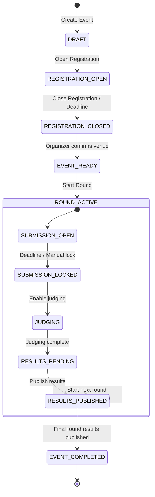

# HackFlow — Offline-First Physical Hackathon Management Platform

## Project Architecture (Source of Truth)

---

## 1. Product Vision

HackFlow is a **complete software platform for conducting physical, in-person hackathons**. It replaces the disconnected toolchain organizers currently use (Google Forms, Excel sheets, paper attendance, paper judging sheets, separate result calculators, manual certificate generators) with a single, coherent operating system.

### Core Flow

```
REGISTRATION → TEAM CREATED → DESK ALLOCATED → PARTICIPANT GETS UNIVERSAL QR
    → PHYSICAL VENUE CHECK-IN → TEAM WORKS IN ASSIGNED ROOM/DESK
    → ROUND STARTS → PROBLEM STATEMENT REVEALED → TEAM SUBMITS
    → JUDGES WALK AROUND PHYSICAL VENUE → JUDGE SCANS TEAM QR
    → DIGITAL JUDGMENT SHEET → MASTER JUDGING MATRIX → SHORTLIST
    → NEXT ROUND → FINAL RANKING → PUBLISH RESULTS → CERTIFICATES
```

### What This Is NOT
- Not a generic online hackathon registration portal
- Not a virtual/remote hackathon tool
- Not a microservices architecture
- Not an event-sourced system

### What This IS
- A full-stack Next.js monolith
- An operational tool for physical venue management
- A mobile-first scanning and judging platform
- A real-time event coordination system

---

## 2. Technology Stack

| Layer | Technology | Rationale |
|---|---|---|
| **Framework** | Next.js 15 (App Router) | Full-stack SSR/SSG/API in one deployment unit |
| **Language** | TypeScript (strict) | Type safety across frontend + backend |
| **Database** | TiDB (MySQL-compatible) | Distributed MySQL; provided externally |
| **ORM** | Drizzle ORM (mysql-core) | Type-safe, lightweight, TiDB-native driver support |
| **Authentication** | NextAuth.js v5 + Google OAuth | Google Sign-In as specified; session-based |
| **Real-time** | Server-Sent Events (SSE) + Polling fallback | See DECISIONS.md — SSE preferred over WebSockets for deployment compatibility |
| **File Storage** | Abstracted storage interface (S3-compatible / local) | Pluggable; no hard-coded provider |
| **Styling** | Vanilla CSS with design tokens | Glassmorphism + Skeuomorphism toggle (Day/Night mode) |
| **QR Generation** | `qrcode` library (client-side generation) | Downloadable, offline-capable QR |
| **QR Scanning** | `html5-qrcode` or `@nicecv/qrcode-reader` | Camera-based scanning in browser |
| **Certificate Gen** | Server-side PDF generation (e.g., `@react-pdf/renderer` or `pdf-lib`) | Secure; no client-side template manipulation |

---

## 3. System Architecture

### 3.1 High-Level Architecture

```
┌─────────────────────────────────────────────────────────────┐
│                    NEXT.JS APPLICATION                       │
│                                                              │
│  ┌──────────────┐  ┌──────────────┐  ┌──────────────────┐   │
│  │  Pages/UI    │  │  API Routes  │  │  Server Actions   │   │
│  │  (React)     │  │  (/api/*)    │  │                    │   │
│  └──────┬───────┘  └──────┬───────┘  └──────┬────────────┘   │
│         │                 │                  │                │
│  ┌──────▼─────────────────▼──────────────────▼────────────┐  │
│  │              MIDDLEWARE (Auth + Role Guard)             │  │
│  └──────────────────────┬─────────────────────────────────┘  │
│                         │                                    │
│  ┌──────────────────────▼─────────────────────────────────┐  │
│  │              SERVICE LAYER (Business Logic)            │  │
│  │  ┌──────────┐ ┌──────────┐ ┌──────────┐ ┌──────────┐  │  │
│  │  │  Event   │ │  Team    │ │  Judge   │ │  Round   │  │  │
│  │  │  Service │ │  Service │ │  Service │ │  Service │  │  │
│  │  └──────────┘ └──────────┘ └──────────┘ └──────────┘  │  │
│  └──────────────────────┬─────────────────────────────────┘  │
│                         │                                    │
│  ┌──────────────────────▼─────────────────────────────────┐  │
│  │              DATA ACCESS LAYER (Drizzle ORM)           │  │
│  └──────────────────────┬─────────────────────────────────┘  │
│                         │                                    │
│  ┌──────────────────────▼─────────────────────────────────┐  │
│  │              SSE MANAGER (Real-time Events)            │  │
│  └────────────────────────────────────────────────────────┘  │
└─────────────────────────────┬───────────────────────────────┘
                              │
                    ┌─────────▼─────────┐
                    │   TiDB Database   │
                    └───────────────────┘
                    ┌───────────────────┐
                    │   File Storage    │
                    │   (S3 / Local)    │
                    └───────────────────┘
```

### 3.2 Project Structure

```
hackathon/
├── docs/                           # Persistent architecture documentation
│   ├── PROJECT_ARCHITECTURE.md     # This file
│   ├── IMPLEMENTATION_PLAN.md      # Phased build roadmap
│   ├── DATABASE_ARCHITECTURE.md    # Schema, indexes, migrations
│   ├── API_ARCHITECTURE.md         # Route definitions
│   ├── SECURITY_ARCHITECTURE.md    # Auth, authz, threat model
│   ├── USER_FLOWS.md               # Role-specific workflows
│   └── DECISIONS.md                # Architectural decision log
├── src/
│   ├── app/                        # Next.js App Router
│   │   ├── (auth)/                 # Auth-related pages (login, callback)
│   │   ├── (public)/               # Public pages (landing, event entry)
│   │   ├── (dashboard)/            # Protected dashboard layouts
│   │   │   ├── organizer/          # Organizer views
│   │   │   ├── coordinator/        # Coordinator views
│   │   │   ├── judge/              # Judge views
│   │   │   └── participant/        # Participant views
│   │   ├── api/                    # API route handlers
│   │   │   ├── auth/               # NextAuth routes
│   │   │   ├── events/             # Event CRUD
│   │   │   ├── teams/              # Team operations
│   │   │   ├── scan/               # Universal QR scan endpoint
│   │   │   ├── judgments/          # Judgment submission
│   │   │   ├── rounds/            # Round management
│   │   │   ├── sse/               # Server-Sent Events streams
│   │   │   └── uploads/           # File upload handling
│   │   ├── layout.tsx             # Root layout
│   │   └── page.tsx               # Landing page
│   ├── components/                 # Shared UI components
│   │   ├── ui/                     # Design system primitives
│   │   ├── scanner/                # QR scanner components
│   │   ├── forms/                  # Form builder components
│   │   ├── dashboard/              # Dashboard widgets
│   │   └── layout/                 # Navigation, sidebars
│   ├── lib/                        # Shared utilities
│   │   ├── db/                     # Database connection + schema
│   │   │   ├── index.ts            # Drizzle client
│   │   │   ├── schema/             # Drizzle table definitions
│   │   │   └── migrations/         # SQL migration files
│   │   ├── auth/                   # Auth configuration
│   │   │   ├── config.ts           # NextAuth config
│   │   │   └── guards.ts           # Role-based auth guards
│   │   ├── services/               # Business logic services
│   │   │   ├── event.service.ts
│   │   │   ├── team.service.ts
│   │   │   ├── desk.service.ts
│   │   │   ├── round.service.ts
│   │   │   ├── judgment.service.ts
│   │   │   ├── qr.service.ts
│   │   │   ├── attendance.service.ts
│   │   │   ├── ranking.service.ts
│   │   │   ├── certificate.service.ts
│   │   │   └── import.service.ts
│   │   ├── storage/                # File storage abstraction
│   │   ├── sse/                    # SSE event manager
│   │   ├── validators/             # Zod schemas for validation
│   │   ├── constants/              # App constants, enums
│   │   └── utils/                  # General utilities
│   ├── hooks/                      # Custom React hooks
│   ├── styles/                     # CSS files + design tokens
│   │   ├── tokens.css              # Design system tokens
│   │   ├── globals.css             # Global styles
│   │   ├── themes/                 # Day/Night theme files
│   │   └── components/             # Component-specific styles
│   └── types/                      # Shared TypeScript types
├── public/                         # Static assets
├── drizzle.config.ts               # Drizzle ORM configuration
├── next.config.ts                  # Next.js configuration
├── package.json
├── tsconfig.json
└── .env.example                    # Environment variable template
```

---

## 4. Roles & Authorization Model

### 4.1 Role Definitions

| Role | Scope | Authentication | Primary Device |
|---|---|---|---|
| **Organizer** | Global + Event-specific | Google Sign-In → session | Desktop |
| **Coordinator** | Event-specific only | Google Sign-In + invitation token | Mobile |
| **Judge** | Event-specific only | Google Sign-In + invitation token | Mobile |
| **Participant** (Team Leader) | Event-specific, own team only | Google Sign-In | Mobile |

### 4.2 Authorization Matrix

| Operation | Organizer | Coordinator | Judge | Participant |
|---|---|---|---|---|
| Create event | ✅ | ❌ | ❌ | ❌ |
| Configure event | ✅ (own events) | ❌ | ❌ | ❌ |
| View all teams | ✅ | ✅ (limited fields) | ✅ (eligible teams) | ❌ |
| Check-in teams | ✅ | ✅ | ❌ | ❌ |
| Submit judgment | ❌ | ❌ | ✅ | ❌ |
| View own team | ✅ | ❌ | ❌ | ✅ |
| Submit project | ❌ | ❌ | ❌ | ✅ (own team) |
| Manage rounds | ✅ | ❌ | ❌ | ❌ |
| Publish results | ✅ | ❌ | ❌ | ❌ |
| Manage desks | ✅ | ❌ | ❌ | ❌ |
| View judgment matrix | ✅ | ❌ | ❌ | ❌ |
| Override ranking | ✅ | ❌ | ❌ | ❌ |
| Generate certificates | ✅ | ❌ | ❌ | ❌ |
| Download certificate | ❌ | ❌ | ❌ | ✅ (own) |

### 4.3 Event-Scoped Roles

Roles are **not global**. A user may be:
- Organizer for Event A
- Judge for Event B
- Participant for Event C

The `event_memberships` table maps `(user_id, event_id, role)`.

---

## 5. Event State Machine



### State Transitions

| From | To | Trigger | Side Effects |
|---|---|---|---|
| DRAFT | REGISTRATION_OPEN | Organizer action | Generates participant link |
| REGISTRATION_OPEN | REGISTRATION_CLOSED | Deadline or manual | Locks registration form |
| REGISTRATION_CLOSED | EVENT_READY | Organizer confirms | Enables coordinator links |
| EVENT_READY | ROUND_ACTIVE | Start Round | Activates round, enables problem reveal |
| SUBMISSION_OPEN | SUBMISSION_LOCKED | Deadline or manual | Locks submissions |
| SUBMISSION_LOCKED | JUDGING | Organizer action | Enables judge scanning for round |
| JUDGING | RESULTS_PENDING | Organizer action | Locks new judgments |
| RESULTS_PENDING | RESULTS_PUBLISHED | Publish action | Advances shortlisted teams, SSE broadcast |
| RESULTS_PUBLISHED | ROUND_ACTIVE | Start next round | Creates new round context |
| RESULTS_PUBLISHED | EVENT_COMPLETED | Final round published | Enables certificates |

---

## 6. Universal QR Architecture

### Design Decision (see DECISIONS.md #D-001)

**Approach: HMAC-signed static token, event-bound, non-rotating.**

Each team receives ONE QR code at registration time. The QR encodes:

```
hackflow:<event_id>:<team_id>:<hmac_signature>
```

Where:
- `event_id` — the event this QR belongs to
- `team_id` — the team identifier  
- `hmac_signature` — HMAC-SHA256 of `event_id:team_id` using a server-side secret

### Why NOT rotating JWT tokens:
1. **Offline requirement**: Participant downloads QR before arriving; rotating tokens invalidate downloaded QR
2. **Venue internet unreliable**: QR must work without live server connection for display (scanning still requires server)
3. **Simplicity**: Static HMAC provides tamper-proof verification without token refresh complexity

### Security Measures:
- HMAC prevents forging QR tokens
- Event binding prevents cross-event QR reuse
- Server-side validation on every scan
- Rate limiting on scan endpoint
- Audit logging of all scans

### Scanner Routing:

```
Scan QR → POST /api/scan
    → Validate HMAC
    → Identify scanner's authenticated role
    → Route to role-specific handler:
        COORDINATOR → Check-in flow
        JUDGE → Judgment flow  
        ORGANIZER → Admin inspection
```

---

## 7. Desk Allocation & Concurrency

### Strategy (see DECISIONS.md #D-002)

**TiDB does NOT support `SKIP LOCKED`.** We use **pessimistic locking with `SELECT ... FOR UPDATE`**.

#### Allocation Algorithm:

```sql
START TRANSACTION;

-- Find an available desk with sufficient capacity
SELECT id FROM desks 
WHERE room_id IN (SELECT id FROM rooms WHERE event_id = ?)
  AND is_allocated = FALSE 
  AND capacity >= ?
ORDER BY room_id, desk_number
LIMIT 1
FOR UPDATE;

-- If found: assign
UPDATE desks SET is_allocated = TRUE, team_id = ? WHERE id = ?;

COMMIT;
```

If no desk is found → team is registered with `desk_id = NULL`, `status = 'WAITLISTED'`.

#### Handling Contention:
- TiDB pessimistic mode: concurrent transactions on the same row will **wait** (not skip)
- Transaction timeout configured to 5 seconds
- Application-level retry with jitter (max 3 retries)
- Under extreme load: batch allocation as fallback

---

## 8. Real-Time Architecture

### Strategy (see DECISIONS.md #D-003)

**Primary: Server-Sent Events (SSE)**  
**Fallback: HTTP Polling (5-second intervals)**

#### Event Types:

| Event | Channel | Consumers | Priority |
|---|---|---|---|
| `round:started` | `event:<event_id>` | All participants | SSE |
| `round:problem_revealed` | `event:<event_id>` | All participants | SSE |
| `round:submission_locked` | `event:<event_id>` | All participants | SSE |
| `results:published` | `event:<event_id>` | All participants | SSE |
| `announcement:new` | `event:<event_id>` | All participants | SSE |
| `team:checked_in` | `event:<event_id>:organizer` | Organizer | SSE |
| `judgment:submitted` | `event:<event_id>:organizer` | Organizer | SSE |
| `desk:updated` | `event:<event_id>:organizer` | Organizer | Polling |

#### Implementation:
- SSE endpoint: `GET /api/sse/[eventId]`
- Client: `EventSource` API with automatic reconnection
- On reconnect: client fetches full state from REST API (server is authoritative)
- Polling fallback: for environments where SSE connections are limited

---

## 9. File Storage Architecture

### Abstraction Layer

```typescript
interface StorageProvider {
  upload(file: Buffer, key: string, metadata: FileMetadata): Promise<string>;
  download(key: string): Promise<Buffer>;
  getSignedUrl(key: string, expiresIn: number): Promise<string>;
  delete(key: string): Promise<void>;
}
```

### Storage Organization:
```
/events/<event_id>/
    /submissions/<round_id>/<team_id>/
        presentation.pdf
        presentation.pptx
    /certificates/<team_id>/
        participant_certificate.pdf
        winner_certificate.pdf
    /imports/
        registration_upload_<timestamp>.xlsx
```

### Validation Rules:
- **PPT/PDF**: Max 50MB, allowed types: `.pdf`, `.pptx`, `.ppt`
- **XLSX/CSV**: Max 10MB, allowed types: `.xlsx`, `.csv`
- Filenames sanitized server-side
- Content-type validated against file magic bytes

---

## 10. UI/UX Architecture

### Design System

The UI supports a **Day/Night toggle** with two distinct aesthetic modes:

| Mode | Aesthetic | Description |
|---|---|---|
| **Night (Default)** | Glassmorphism | Dark canvas, frosted glass cards, gradient spotlights, blur effects |
| **Day** | Skeuomorphism | Light backgrounds, tactile surfaces, subtle shadows, paper-like textures |

### Design Tokens (from reference design MD):
- Colors follow a dark-first palette with white primary text
- Typography uses Inter Variable for body, with tight letter-spacing
- Border radius scale: 4px → 6px → 10px → 15px → 20px → 30px → 100px (pill)
- Spacing: 5px base unit (5/10/15/20/30/40/96)
- Gradient spotlight cards as signature decorative elements

### Device Priorities:
| Role | Primary Device | Layout Strategy |
|---|---|---|
| Organizer | Desktop | Information-dense tables, sidebars, modals |
| Coordinator | Mobile | Split-screen (scanner top, roster bottom) |
| Judge | Mobile | Split-screen (scanner top, roster bottom) |
| Participant | Mobile (responsive) | Single-column, persistent QR anchor |

---

## 11. Edge Cases Registry

See IMPLEMENTATION_PLAN.md for phase-specific edge cases. Master list:

### Registration
- Simultaneous registration race condition → pessimistic locking
- No desks available → waitlist
- Duplicate team name → unique constraint per event
- Duplicate leader email per event → unique constraint
- Registration closes while form is being filled → server-side deadline check
- Excel import with invalid/duplicate rows → validation + error summary

### Physical Operations
- Team drops out → organizer releases desk, waitlisted team eligible
- Participant loses phone → downloaded QR fallback
- Participant loses QR → coordinator manual check-in
- Camera fails → manual roster fallback
- Poor internet → downloadable QR, cached dashboard, polling fallback
- Coordinator scans already-checked-in team → show "Already checked in" with details
- Judge scans team not yet checked in → see DECISIONS.md #D-005

### Judging
- Same judge double-submits → unique constraint + idempotency key
- Different judges score same team → allowed by design
- Judge accidentally submits wrong score → 10-second undo window + organizer override
- Network retry causes duplicate → server-side idempotency
- Judge opens sheet then backs out → no lock created; draft belongs to this judge only

### Rounds
- Round starts while participant offline → server state authoritative; SSE on reconnect
- Participant views stale page → polling + SSE ensures eventual consistency
- Organizer changes desk after assignment → audit logged, participant dashboard updates
- Room closes between rounds → manual reassignment for affected teams
- Fewer shortlisted teams than expected → organizer proceeds with actual count
- Tied scores → manual rank override by organizer

### Security
- QR replay → HMAC validation + scan audit log
- Wrong event QR → event binding in QR payload
- Unauthorized role access → server-side middleware enforcement
- IDOR → all queries scoped by authenticated user + event membership
- Expired invitation → token expiry checked server-side

---

## 12. Cross-References

| Document | Purpose |
|---|---|
| [IMPLEMENTATION_PLAN.md](file:///e:/PROJECTS%20SEP%202026/HACKATHON/docs/IMPLEMENTATION_PLAN.md) | Phased build roadmap with acceptance criteria |
| [DATABASE_ARCHITECTURE.md](file:///e:/PROJECTS%20SEP%202026/HACKATHON/docs/DATABASE_ARCHITECTURE.md) | Complete schema, indexes, migrations |
| [API_ARCHITECTURE.md](file:///e:/PROJECTS%20SEP%202026/HACKATHON/docs/API_ARCHITECTURE.md) | All API routes, request/response contracts |
| [SECURITY_ARCHITECTURE.md](file:///e:/PROJECTS%20SEP%202026/HACKATHON/docs/SECURITY_ARCHITECTURE.md) | Auth, authorization, threat model |
| [USER_FLOWS.md](file:///e:/PROJECTS%20SEP%202026/HACKATHON/docs/USER_FLOWS.md) | Role-specific user journeys |
| [DECISIONS.md](file:///e:/PROJECTS%20SEP%202026/HACKATHON/docs/DECISIONS.md) | Architectural decision log |
